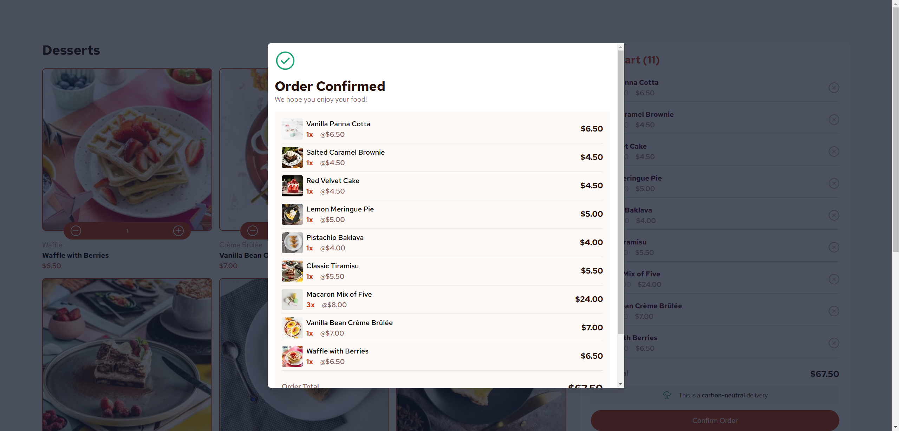

# Frontend Mentor - Product list with cart solution

This is a solution to the [Product list with cart challenge on Frontend Mentor](https://www.frontendmentor.io/challenges/product-list-with-cart-5MmqLVAp_d). Frontend Mentor challenges help you improve your coding skills by building realistic projects. 

## Table of contents

- [Overview](#overview)
  - [The challenge](#the-challenge)
  - [Screenshot](#screenshot)
  - [Links](#links)
- [My process](#my-process)
  - [Built with](#built-with)
  - [What I learned](#what-i-learned)
  - [Continued development](#continued-development)
  - [Useful resources](#useful-resources)
- [Author](#author)
- [Acknowledgments](#acknowledgments)

## Overview

### The challenge

Users should be able to:

- Add items to the cart and remove them
- Increase/decrease the number of items in the cart
- See an order confirmation modal when they click "Confirm Order"
- Reset their selections when they click "Start New Order"
- View the optimal layout for the interface depending on their device's screen size
- See hover and focus states for all interactive elements on the page

### Screenshot
#### Desktop

#### Tablet

#### Desktop

### Links

- Solution URL: [Add solution URL here](https://your-solution-url.com)
- Live Site URL: [Add live site URL here](https://your-live-site-url.com)

## My process

### Built with

- Semantic HTML5 markup
- CSS custom properties
- Flexbox
- CSS Grid
- Mobile-first workflow
- [React](https://reactjs.org/) - JS library
- [Next.js](https://nextjs.org/) - React framework
- [Tailwind CSS](https://tailwindcss.com/) - CSS Framework

### What I learned

I learned how to install NodeJS and create a NextJS and Tailwind project, what are packages and how to install it.
I also learned to use Tailwind and familiarized with Node and NextJS

### Continued development

I want to keep improving my Tailwind skills and NextJS. I want to be able to use more components so my websites would be easier to maintain

### Useful resources

- [Tailwind documentation](https://tailwindcss.com/docs/) - This helped me to discover Tailwind and how to create custom classes.
- [NextJS documentation](https://nextjs.org/docs) - It helped me with the project creation and structure mainly.

## Author

- Github - [@julienbouze](https://github.com/julienbouze)
- Frontend Mentor - [@julienbouze](https://www.frontendmentor.io/profile/julienbouze)